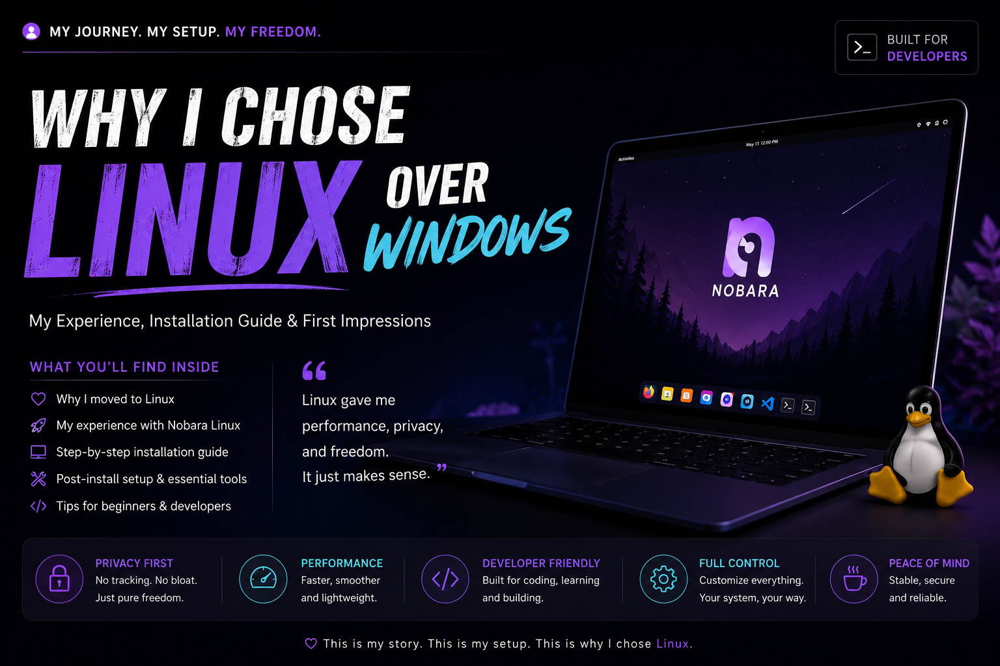
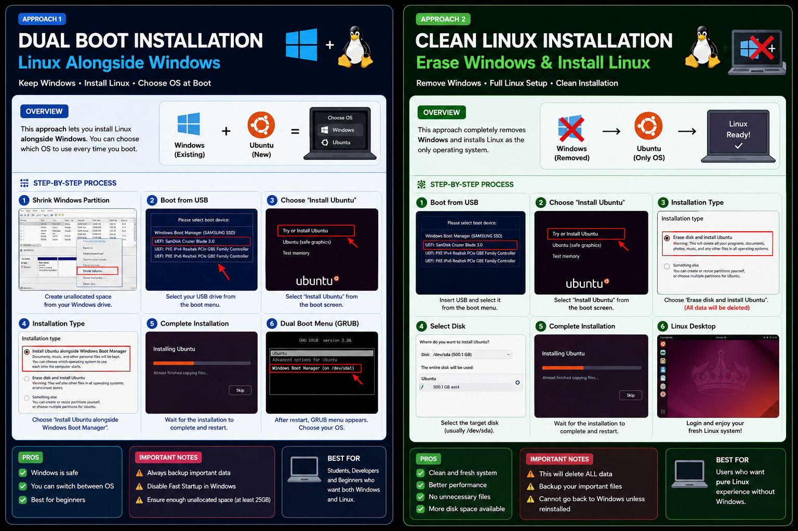

# 🐧 Complete Linux Installation & Setup Guide for Beginners



> Step-by-step Linux installation guide for Ubuntu, Fedora, Nobara, Linux Mint, and other Linux distributions.

---

# 📚 Table of Contents

- [Introduction to Linux](#-introduction-to-linux)
- [Things Required Before Installation](#-things-required-before-installation)
- [Downloading Linux ISO](#-downloading-linux-iso)
- [Creating Bootable USB](#-creating-bootable-usb)
- [Entering BIOS / Boot Menu](#-entering-bios--boot-menu)
- [Secure Boot](#-secure-boot-if-required)
- [Starting Linux Installer](#-starting-linux-installer)
- [Installation Process](#-installation-process)
- [Partitioning Guide](#-partitioning-guide)
- [First Boot Setup](#-first-boot-setup)
- [Essential Linux Commands](#-essential-linux-commands)
- [Common Problems & Fixes](#-common-problems--fixes)
- [Recommended Beginner Tools](#-recommended-beginner-tools)
- [Final Thoughts](#-final-thoughts)

---

# 🐧 Introduction to Linux

Linux is an open-source operating system widely used by developers, engineers, cybersecurity professionals, researchers, and server administrators.

Popular Linux distributions include:

- Ubuntu
- Fedora
- Nobara
- Linux Mint

Linux is preferred because of:
- Powerful terminal
- Better development environment
- Customization
- Stability
- Performance
- Open-source ecosystem

---

# 💻 Things Required Before Installation

Before installing Linux, make sure you have:

- Laptop or PC
- Stable internet connection
- USB drive (minimum 8GB)
- Charger connected
- Backup of important files
- At least 25GB free storage

---


# 📥 Downloading Linux ISO

## Official Downloads

| Distribution | Download Link |
|---|---|
| Ubuntu | https://ubuntu.com/download/desktop |
| Fedora | https://fedoraproject.org/workstation/download |
| Nobara | https://nobaraproject.org/download-nobara |
| Linux Mint | https://linuxmint.com/download.php |

---

## Steps

### Step 1
Open your browser.

### Step 2
Visit official Linux website.

### Step 3
Click:

```text
Download
```

### Step 4
Choose version:
- Ubuntu Desktop
- Fedora Workstation
- Nobara Official
- Linux Mint Cinnamon

### Step 5
Wait for ISO download to complete.

Usually:
```text
4GB – 6GB
```

Save location:
```text
Downloads Folder
```

---

# 🔥 Creating Bootable USB

## Download Rufus

https://rufus.ie/en/

Alternative:
https://etcher.balena.io

---

## Steps

### Step 1
Insert USB drive.

⚠️ WARNING:
```text
All USB data will be erased.
```

### Step 2
Open Rufus.

### Step 3
Under:
```text
Device
```

Select USB drive.

### Step 4
Under:
```text
Boot Selection
```

Click:
```text
SELECT
```

Choose downloaded ISO file.

---

## Recommended Settings

| Option | Value |
|---|---|
| Partition Scheme | GPT |
| Target System | UEFI |
| File System | FAT32 |

---

### Step 5
Click:
```text
START
```

If popup appears:
```text
Write in ISO Image Mode
```

Click:
```text
OK
```

Wait until status shows:
```text
READY
```

---

# ⚙️ Entering BIOS / Boot Menu

## Step 1
Completely shut down laptop.

NOT restart.

---

## Step 2
Insert bootable USB.

---

## Step 3
Turn on laptop.

Immediately repeatedly press boot key.

---

## Common Boot Keys

| Brand | Boot Key |
|---|---|
| HP | ESC / F9 |
| Dell | F12 |
| Lenovo | F12 |
| ASUS | ESC |
| Acer | F12 |
| MSI | F11 |

---

## Step 4

Boot Menu appears.

Use arrow keys.

Select:
```text
USB Drive
```

Press:
```text
Enter
```

---

# 🔒 Secure Boot (If Required)

Sometimes Linux may not boot because Secure Boot is enabled.

---

## Steps

### Step 1
Enter BIOS using:
```text
F2 / DEL / ESC
```

### Step 2
Find:
```text
Secure Boot
```

### Step 3
Set:
```text
Disabled
```

### Step 4
Save changes using:
```text
F10
```

Restart system.

---

# 🚀 Starting Linux Installer

Linux boot screen appears.

Choose:
```text
Try or Install Linux
```

Wait for installer to load.

---

# 🛠️ Installation Process

## Language Selection
Choose:
```text
English
```

Click:
```text
Continue
```

---

## Keyboard Layout
Choose:
```text
English (US)
```

---

## Internet Connection
Connect WiFi if available.

Recommended because:
- Updates install automatically
- Drivers download automatically

---

## Installation Type

Choose:
```text
Normal Installation
```

Enable:
```text
Install third-party software
```

Click:
```text
Continue
```

---

# 💾 Partitioning Guide




## Option 1 — Install Alongside Windows

Recommended for beginners.

Choose:
```text
Install alongside Windows
```

Best for dual boot setup.

---

## Option 2 — Erase Disk and Install Linux

⚠️ WARNING:
```text
Deletes all files and Windows completely.
```

---

## Option 3 — Manual Partitioning

Advanced users only.

| Partition | Purpose |
|---|---|
| / | Root System |
| /home | Personal Files |
| swap | Virtual Memory |

---

# 👤 User Account Setup

Enter:
- Your Name
- Computer Name
- Username
- Password

Example:
```text
Username: sravanya
```

---

# 🔄 Restart System

After installation:

Click:
```text
Restart Now
```

When prompted:
```text
Remove USB Drive
```

Press:
```text
Enter
```

---

# 🎉 First Boot Setup

Linux login screen appears.

Enter password.

Desktop loads successfully.

Congratulations — Linux is installed.

---

# 💻 Open Terminal

Shortcut:
```bash
Ctrl + Alt + T
```

---

# 🔄 Update System

## Ubuntu / Linux Mint

```bash
sudo apt update
sudo apt upgrade -y
```

---

## Fedora / Nobara

```bash
sudo dnf update -y
```

---

# 📦 Install Git

## Ubuntu

```bash
sudo apt install git -y
```

## Fedora / Nobara

```bash
sudo dnf install git -y
```

---

# 🧠 Essential Linux Commands

| Command | Purpose |
|---|---|
| pwd | Show current directory |
| ls | List files |
| cd | Change directory |
| mkdir | Create folder |
| rm | Remove files |
| clear | Clear terminal |
| sudo | Run as administrator |

---

# ❗ Common Problems & Fixes

## USB Not Showing
- Recreate bootable USB
- Use another USB port
- Disable Secure Boot

---

## Black Screen After Boot
- Update GPU drivers
- Try recovery mode
- Use safe graphics mode

---

## WiFi Not Working
- Use Ethernet temporarily
- Install drivers
- Update system

---

## Windows Not Showing in Dual Boot

```bash
sudo update-grub
```

---

# 🛠️ Recommended Beginner Tools

| Tool | Purpose |
|---|---|
| Git | Version Control |
| VS Code | Code Editor |
| Docker | Containers |
| Node.js | JavaScript Runtime |
| Python | Programming |
| Postman | API Testing |

---

# 📝 Final Thoughts

Linux is an excellent platform for learning:
- development
- open source
- terminal workflows
- system internals
- programming

The installation process may feel difficult initially, but it becomes easier with practice and exploration.

---

# ⭐ Support

If this guide helped you:
- Star the repository
- Share with beginners
- Contribute improvements

---
